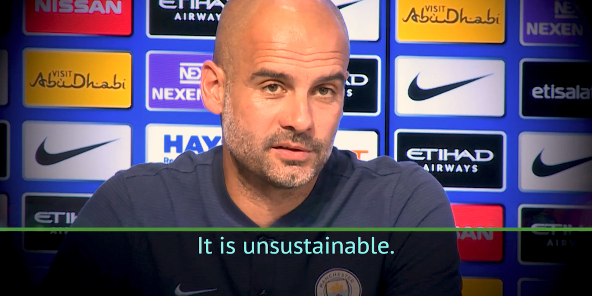
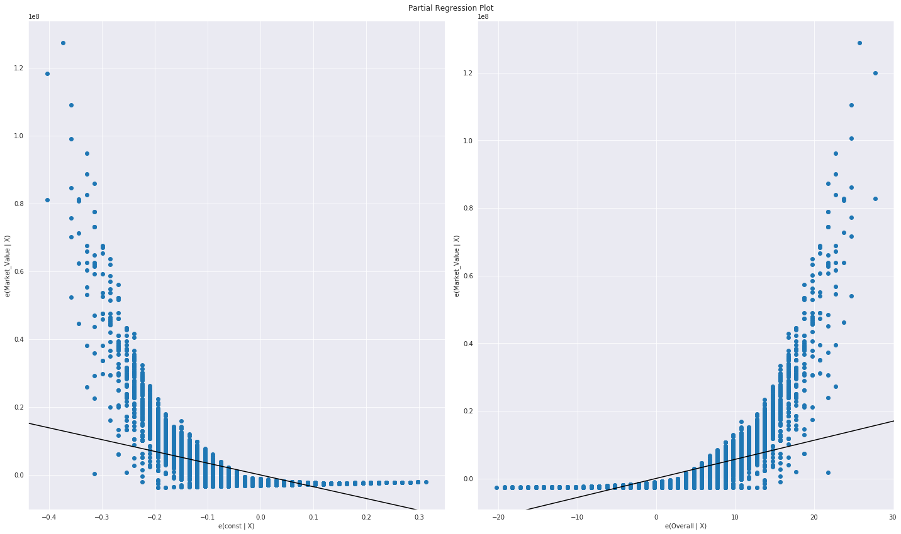

# Deriving Value from "The Beautiful Game":  
## Exploiting Optimal Pricing for Marketable FIFA players  

  

## Background  
Soccer, by a large margin, remains the most popular sport in the world. Nielsen's annual "World Football Report," a survey of major markets across the Americas, Europe, the Middle East and Asia, not only shows the sport's vast popularity, but that its growth is still on the rise. Notably, China and the United States, the world's two largest economies, are contributing to the sport's following--albeit at a far slower rate than its counterparts across the globe. At more than 40% of interest worldwide, soccer--or football--is well ahead of its nearest rival sports (to my surprise, basketball weighs in at No. 2).

Consequently, club teams can afford outrageous sums of money to spend on single players. Often, they are not looking for the best value or effective combinations of players--but instead, the best players and coaches evaluated on an individual metric. Consider, for example, that during a single transfer window (the time alloted for clubs to make trades or "buy" players), Paris St-Germain broke a record for money spent on a single player, and then proceeded to break that record with their next purchase.  

This unprecedented spending spree by the wealthiest clubs has been under scrutiny for several years now, with coaches and fans alike wondering when stronger regulations will be enacted.

## "Unsustainable"  
Meanwhile, 'average' clubs with considerably smaller budgets cannot get anywhere near star players attached to star prices. What to do?  

First, look to the data:  

 - Scour and scale a variety of distributions to pinpoint otherwise hidden pockets of real player talent costing far less than the name brands.  
 - Apply creativity with features toward a regression model and techniques to investigate why some prices are substantially lower at the same overall value.

Ample opportunity may well exist for a smart club burdened with a deficit, backed by rigorous, data-driven analyses to optimize on value vs rating as a solid strategy to rebuild its starting XI.  

## Motivating Questions
Is there a linear relationship between a player's ability and market value--or multinomial predictors of those same values? If so, which features can help managers with smaller budgets to exploit distribution gaps of lower prices for better overall players?

## Data  
I used a dataset consisting of 89 column features including on and off-field statistics (e.g., wage, passing) and 18702 labels representing FIFA's list of current professional soccer players, worldwide. The data was web-scraped from the website Sofifa which rates and provides values for current soccer players.

### Cleaning, Organizing, and Feature Engineering
Scrubbing, interpreting, validating, and re-interpreting the dataset was by far my most time-consuming and challenging endeavour for a number of reasons: 
- the dataset was web-scraped which meant there could be reliability issues; as such, I did a lot of validating and spot-checking using multiple sources when there appeared to be an outlier, a player at a wrong club (clubs didn't play a role in my EDA but scared me into thinking there might be other mistaken values associated with the player)
- when a Pandas function or plotting attempt threw an error, I first tried to use built-in methods; more often than not, I ended up searching for problems manually. This lack of consistency cost more time than it did to remove or fix the problem. I'm beginning to believe the informal adage: 80 percent data wrangling to 20 percent analysis!
- the FIFA rating system for some categories were confounding because of their internal metrics which are not transparent to the public. Most of the time, those values were consistent, but their (lack of) interpretibility at times made it difficult to trust so I had to examine each of the 89 columns to ensure I understood what the values were actually representing; if I was unsure, I had no choice but to drop the column. For example, a value for 'Potential' could mean a forecast for the coming season or over the player's lifetime--or neither. As I was interested in rating vs value, I could only rely on the current stats of a player. If I knew more, I think 'Potential' could have been informative to value
- Feature engineering of monetary value in highly inconsistent and abbreviated form ('55.3M', '0' in Euros) over 18702 rows doesn't lend itself well to doing simple arithmetic in Python. In addition, conversion of strings (e.g., 'Club', 'Nationality') had to be converted into categorical, numeric values. Outside of a classification problem, turns out this feature conversion did not play into the overall analysis.

### Plotting
I utilized this project as an opportunity to try different plotting libraries. I'm not sure this was wise given the tight timeframe of the project. First, I tried Altair/Vega about which I read complimentary things. That ended quickly, as I had rendering issues. By that, I mean I saw nothing--literally nothing. No errors, no plot. Then I tried Plotly which produced great looking plots, but depending on which kind of plot, and if I was using a notebook, or if I wanted to save plots online/offline, or to even use it at all offline without an account... it could have wasted a lot of my time. And it did. All you need to know is that I had seven different import statements just to get it going. It was fun to see interactive Javascript with the plots--but far from a plotting party. I managed to get a couple of useful plots out of the effort, but for the rest I used Seaborn.

## EDA
- Based on my hypothesis, I plotted the relationship between Overall Value and Rating to obtain a preliminary look at its distribution
- I used regression plots to show how much pricing was a poor predictor of player value, and to set up possible features with better predictive value
- I plotted both a heatmap and pair plots as a way to simultaneously examine multiple attributes, but primarily to search for variables showing a high degree of multicollinearity (e.g., Sprint Speed and Acceleration) which served as a basis for dropping such columns from the dataset
- I then chose the best range from the Value/Rating relationship; specifically, the area in the distribution where I estimate one can buy more player for less money
- I conclude by discussing the range of Market Values along a single axis of Player Rating

---
The first thing I noted was that the two distributions from my question, Market Value and Player Rating, were vastly different. While Player Rating held a very symmetric, normal distribution, Market Value was skewed toward the extreme right side (the expensive side).  

Running regression with the two features (Overall vs Market Value), the `Adj. R-squared: 0.393` demonstrates that overall ability is not a very good predictor of Market Value. From a predictive approach, this score is unequivocally abysmal. On the other hand, it's a good initial indicator of the hypothesis: a player's ability is not a good indicator his monetary worth. As such, this indicates there may be room for managers to exploit the discrepancy. That is, they can mine overall value for equal or less than a player's stated overall ability.

  

Surprisingly... normal  

Now, here's a plot showing both Rating and Value that shows what happens to that normal distribution when it encounters substantial left skew.  

  

Now all of those nicely distributed rating values have aggregated to the right side. This suggests that 1) a good player with a reasonably high rating (i.e., 80) will most likely be paid less than his counterparts in terms of the value/rating relationship even if that other player's rating is only a few points higher; 2) there exists a trove of players within a similar skill scope commensurate with other players bought at a considerably higher--and sub-optimal--price.  

Let's look at a few of the relationships:  

  

And here's a wider view. This heatmap, while packed with features, perhaps is the most informative plot in terms of a player's 'real' value versus skill set.  

## Conclusion

The correlation between value/rating is a surprising (to me) 0.63. The long, left, and flat tail provides much of the correlative relationship despite the sharp, upward spike in value.

To answer my own question in a word: no. While the player overall rating is normally distributed, its counterpart, player value, is not. Correlations show a positive relationship but mitigating factors such as the proportion of that correlation does not mean there isn't room for a manager to leverage player value with respect to talent. In addition many of the positive correlations were derived from feature multicollinearity. Competence between short passing and long passing, for example, holds little surprise--as such those features can safely be dropped.

That said, my biggest finding is that a level of an 80 ability rating (near the crook of the elbow in the distribution), is a good threshold for high talent. The mean value at 80 is 14,998,195 with a max value of 26,085,000, At a talent level of 80, there are many players to consider within a short range of 80 for managers with deficits to consider within future transfer windows. 'Name brand' players, i.e., popular players should not affect decisions as there is little evidence in the data to suggest they are necessarily predictive of good value. 

The exception is at the far end of the distribution--near an outlier threshold--where players alike Lionel Messi, Neymar, and Cristiano Ronaldo live. While difficult to quantify a relationship between their talent and given their enormous fees, their contributions to record-breaking goal scoring and leading their teams consistently to championship level are intangible. A separate analysis, if so desired, would need to be conducted on those players alone. 

But that is beyond the scope of this study. Here, we looked for exploitative markers, crevices within distributions, and the knowledge that overall ability is a poor predictor of pricing--to suggest potential gains of those looking for good-to-excellent players for far less money are indeed available and if exercised, may be a positive step toward parity. In the context of outlandish sums spent on soccer--Pep Guardiola's point in the lead photo--applies to those teams already spending those outsized sums. For those teams outside that threshold, sustainability means something else altogether. Survival depends on intuition, yes, but statistics and creativity may play an even bigger role.

## Closing Considerations  
Although my goal for this project was solely to conduct a regression analysis, here are some steps I'd recommend for continuing this work.  
 - *If* plausible to gain the data, a time-series analysis would be my first priority; it has high potential to reveal new features unavailable from a 'snapshot' perspective, and thus informing a manager's decision to take risks if inconsistencies in play are the cause of lower player prices. 
 - Methods such as Latent Dirochlet Analysis (LDA) could very well identify otherwise 'hidden' features.
 - Additional feature engineering informed by a rigorous analysis of feature importances outside of the multicollinearity found in many/most of the existing dataset features may yield additional clues and exploitative holes for managers to consider.  
 - Contain data leakage. I'd scour for additional data containing aggregate values rather than a rating system. The use of rating system data across features is risky without knowing the initial metrics under FIFA's hood, as discussed at the outset.  
 - A completely different analysis converting this study into a classification problem--or even a recommender for managers--could yield great results with different methods. Ensemble methods with a variety of regressors plus Naive Bayes, TF-IDF, and neural nets could break open otherwise hidden or latent features as strong indicators within a formal analysis.
 

References:  
[Nielsen World Football Report](https://www.nielsen.com/uk/en/insights/reports/2018/world-football-report.html)  
[Sofifa](https://sofifa.com/)  
*image labeled for non-commercial reuse  

