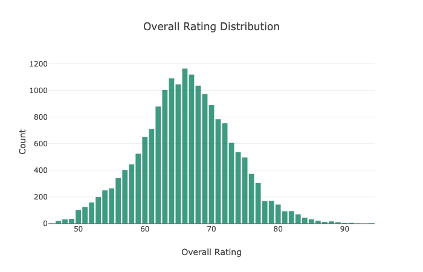
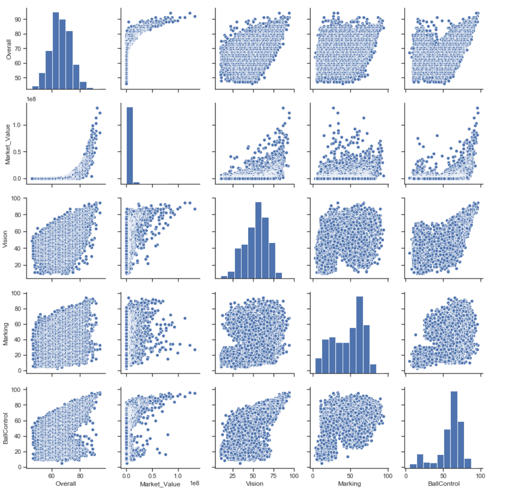
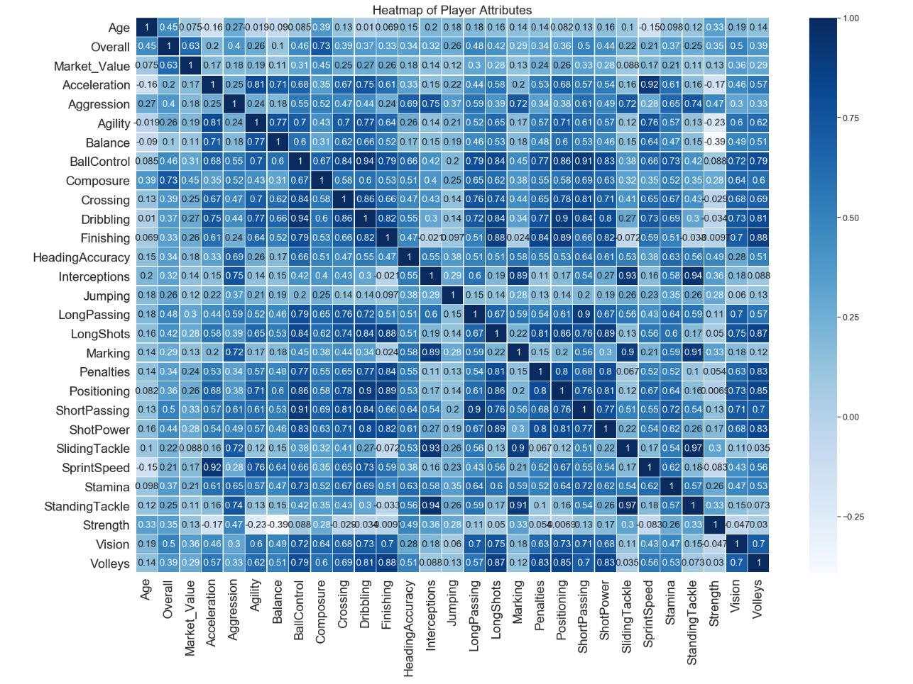

## Deriving Value from "The Beautiful Game": An Exploratory Data Analysis

Soccer, by a large margin, is the most popular sport in the world. In Nielsen's annual "World Football Report," a survey of major markets across the Americas, Europe, the Middle East and Asia, not only shows the sport's vast popularity, but that it's still on the rise. Notably, China and the United States, the world's two largest economies, are contributing to the sport's following--albeit at a far slower rate than its counterparts across the globe. At more than 40% of interest worldwide, soccer--or football--is well ahead of its nearest rival sports (basketball weighs in at No. 2).

Consequently, club teams can afford outrageous sums of money to spend on single players. Often, they are not looking for the best value or effective combinations of players--but instead, the best players and coaches evaluated on an individual metric. Consider, for example, that during a single transfer window (the time alloted for clubs to make trades or "buy" players), Paris St-Germain broke a record for money spent on a single player, and then proceeded to break that record with their next purchase.

## Question
Is the relationship between a player's ability and his market value normally distributed?

## Data  
I used a dataset consisting of 89 column features including on and off-field statistics (e.g., wage, short passing) and 18702 labels representing FIFA's list of current professional soccer players, worldwide. The data was web-scraped from the website Sofifa which rates and provides values for current soccer players.

### Cleaning, organizing, and interpreting the dataset was by far my most time-consuming and challenging endeavour for a number of reasons: 
- the dataset was web-scraped which meant there could be reliability issues; as such, I did a lot of validating and spot-checking using multiple sources when there appeared to be an outlier, a player at a wrong club (clubs didn't play a role in my EDA but scared me into thinking there might be other mistaken values associated with the player)
- when a Pandas function or plotting attempt threw an error, I first tried to use built-in methods; more often than not, I ended up searching for problems manually. For example, some columns had a '+' (and sometimes an additional value) next to the original value which I could not reliably interpret. This lack of consistency cost more time than it did to remove or fix the problem
- the FIFA rating system for some categories were confounding because of their internal metrics which are not transparent to the public. Most of the time, those values were consistent, but their (lack of) interpretibility at times made it difficult to trust so I had to examine each of the 89 columns to ensure I understood what the values were actually representing; if I was unsure, I had no choice but to drop the column. For example, a value for 'Potential' could mean a forecast for the coming season or over the player's lifetime--or neither. As I was interested in rating vs value, I could only rely on the current stats of a player. If I knew more, I think 'Potential' could have been informative to value
- conversion of monetary value in abbreviated form, e.g., '55.3M', '353K' in Euros over 18702 rows doesn't lend itself well to doing even simple arithemetic in Python

### Plotting
I used this capstone as an opportunity to try different plotting libraries. I'm not sure this was wise given the tight timeframe of the project. First, I tried Altair/Vega about which I read complimentary things. That ended quickly, as I had rendering issues. By that, I mean I saw nothing--literally nothing. No errors, no plot. Then I tried Plotly which produced great looking plots, but depending on which kind of plot, and if I was using a notebook, or if I wanted to save plots online/offline, or to even use it at all offline without an account... it could have wasted a lot of my time. And it did. All you need to know is that I had seven different import statements just to get it going. It was fun to see interactive Javascript with the plots--but not fun enough. I managed to get a couple of useful plots out of the effort, but for the rest I used Seaborn.

## EDA Methodology
- Based on my question, I plotted the relationship between Overall Value and Rating to obtain a preliminary look at its distribution
- Next, I plotted both a heatmap and pair plots as a way to simultaneously examine multiple attributes, but primarily to search for variables showing a high degree of multicollinearity (e.g., Sprint Speed and Acceleration) which served as a basis for dropping such columns from the dataset
- I then chose the best sample from the Value/Rating relationship; specifically, the area in the distribution where I estimate one can buy more player for less money
- I conclude by discussing the range of Market Values along a single axis of Player Rating

---
The first thing I noted was that the two distributions from my question, Market Value and Player Rating, were vastly different. While Player Rating held a very symmetric, normal distribution, Market Value was skewed toward the extreme right side (the expensive side).

Surprisingly... normal

Now, here's a plot showing both Rating and Value that shows what happens to that normal distribution when it encounters some serious left skew.

Now all of those nicely distributed rating values have aggregated to the right side. This suggests that 1) a good player with a reasonably high rating (i.e., 80) will most likely be paid less than his counterparts in terms of the value/rating relationship even if that other player's rating is only a few points higher; 2) there are a lot of player within a sweet spot who have the same rating as another with a much higher price.

Let's look at a few of the relationships:

And here's a wider view:

## Conclusion:

The correlation between value/rating is a surprising (to me) 0.63. The long, left, and flat tail provides much of the correlative relationship despite the sharp, upward spike in value.

So, to answer my question, the answer is no. While the player overall rating is normally distributed, its counterpart, player value is not. The correlation shows a positive relationship but mitigating factors such as the proportion of that correlation does not mean there isn't room for a manager to leverage player value with respect to talent. A level of 80 (near the crook of the elbow in the distribution), is a good threshold for high talent. The mean value at 80 is 14,998,195, and with a max value of 26,085,000, also at a talent level of 80, there are many players to consider within that range for managers within the coming transfer window this summer.

My next steps? If I were to continue with this project, I'd pick a dataset that contains all aggregate values rather than a rating system. The rating system across the categories has too much influence on the outcome without knowing the metrics under FIFA's hood. I would also extend the analysis with a series of hypothesis tests toward making actual, rather than speculative or exploratory predictions. That said, I will also look to other potential projects that might extend my skill set through application; this is one of my takeaways--I learned a lot and at a faster rate when using tools we've learned in an applied context.

References:  
[Nielsen World Football Report](https://www.nielsen.com/uk/en/insights/reports/2018/world-football-report.html)  
[Sofifa](https://sofifa.com/)
